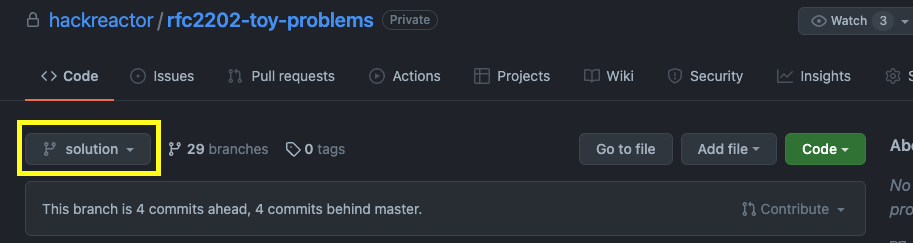
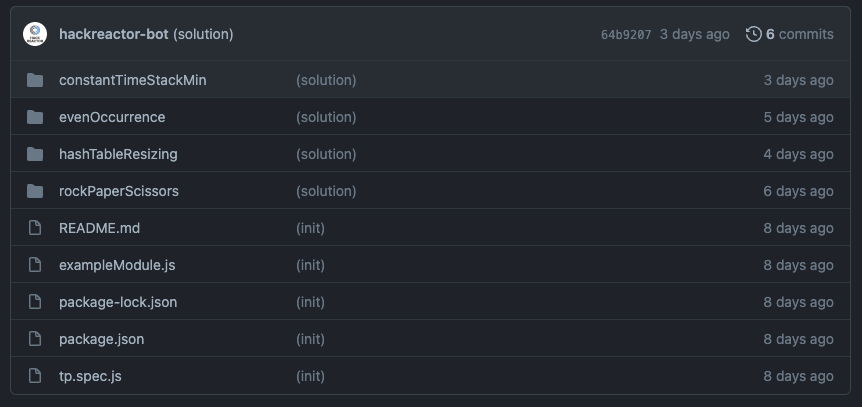

# How To: Access Solutions 
> NOTE: Solution branches will always exist on the repo you forked from at the end of each sprint. You will need to do this process for **EVERY** repo. 

There are several ways you can view the solution branch to a repo. We provide two options currently. 

- View solution on Github 
- View solution on Local Machine

# Solution on Github 
To view the solution on github you must do the following steps: 
1. Go to the original repo on github (The one you forked from). Repo will look like `hackreactor/cohortname-reponame`. Example: `hackreactor/rfc2202-toy-problems` 
2. On the repo page you will see a dropdown menu labeled `master`. This is the default branch for viewing. To view the solution branch select `solution`. 



3. You can now navigate the solution code in the code panel. 



# Solution on Local Machine
The process to get the solution code on your local machine is more involved and will require to connect your local code to the repo you forked from via an `upstream` url.

### Steps: 
#### 1. Set upstream url. 

For us to make a connection to the original repo we will need to add a new url by the name of *upstream*. 

In Terminal: 
```bash
git add url upstream [url]
```
> NOTE: replace [url] with the url of the repo you forked from. I.E. `hackreactor/rfc2202-toy-problems` not `dalton/rfc2202-toy-problems`

#### 2. Fetch upstream solution branch.

Now we want to get the solution branch that was released on the upstream repo. 

In Terminal: 
```bash
git fetch upstream solution
```

#### 3. Checkout to solution branch. 

In Terminal: 
```bash
git checkout solution
```

#### 4. Pull down updates while in the solution branch (Whenever new solutions are available).

In Terminal: 
```bash
git pull upstream solution
```

You will now be able to navigate the solution code on your local machine. 